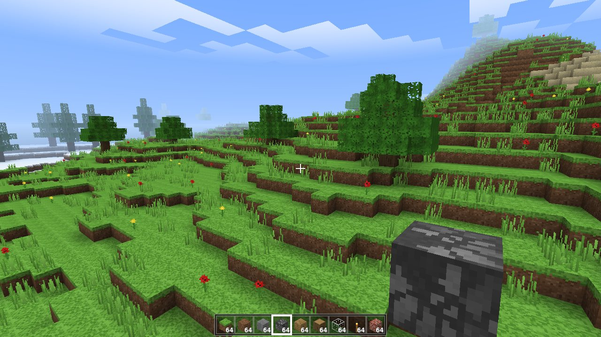
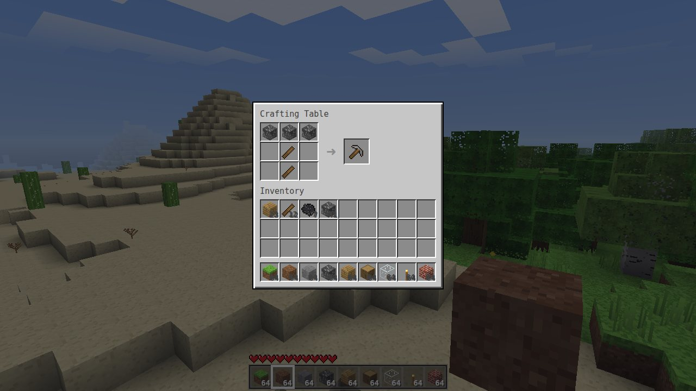

# ClaudeCraft

**A Minecraft-inspired voxel sandbox game, built completely from scratch** in plain JavaScript and raw WebGL2: no game engine, no libraries, no image or sound files. Every texture, icon and sound effect is generated by code at startup.


## ⬇️ Download & play

| Platform | Download | How to run |
|---|---|---|
| **Windows** | [**ClaudeCraft.exe**](https://github.com/Jeep200092919/Minecraft-Claude-Version/raw/HEAD/downloads/ClaudeCraft.exe) (1.8 MB) | Double-click it. The game opens in its own window. |
| **Any OS** | [**ClaudeCraft.zip**](https://github.com/Jeep200092919/Minecraft-Claude-Version/raw/HEAD/downloads/ClaudeCraft.zip) (0.9 MB) | Unzip it, then run `ClaudeCraft.exe` (Windows) or open `ClaudeCraft.html` in your browser. |
| **Single file** | [**ClaudeCraft.html**](https://github.com/Jeep200092919/Minecraft-Claude-Version/raw/HEAD/downloads/ClaudeCraft.html) (0.2 MB) | Open it in Chrome, Edge or Firefox. The whole game is this one file. |

- **About the .exe:** it is a small launcher with the complete game embedded inside. It unpacks the game to `%LOCALAPPDATA%\ClaudeCraft` and opens it in a chromeless Microsoft Edge (or Chrome) app window, so it looks like a normal desktop program. Edge ships with Windows 10 and 11. The launcher isn't code-signed, so Windows SmartScreen may show *"Windows protected your PC"*. Click **More info → Run anyway**. If you'd rather not run an .exe, the `.html` file is the same game.
- **Requirements:** a browser with WebGL2 (any recent Chrome, Edge, Firefox or Safari), plus a keyboard and mouse.
- Worlds are **saved automatically** in the browser (every 30 s, on pause, and on quit).

## Screenshots

| | |
|---|---|
|  |  |
|  |  |
|  |  |



## The prompt, recreated

The original request was *"create a Minecraft from scratch"*. Before writing any code, I expanded it into this full specification and then built it:

> Build a playable, Minecraft-style voxel sandbox **from scratch**: vanilla JavaScript and raw WebGL2, zero dependencies, no copied or downloaded assets.
>
> 1. **Infinite procedural world.** Seeded and deterministic, streamed in 16×128×16 chunks around the player. Continents and oceans, beaches, plains, forests, deserts, snowy tundra and mountains with snow caps. Winding "spaghetti" caves and big caverns, lava lakes deep underground, ore veins (coal, iron, gold, diamond) at realistic depths, trees that cross chunk borders (oak, birch, spruce), cacti, flowers and tall grass.
> 2. **Proper rendering.** Hidden-face culling, per-vertex ambient occlusion, smooth lighting, sunlight *and* torch light spread by flood fill and updated live when you edit the world. Pixel-art texture array, transparent water, cut-out leaves and glass, swaying plants, animated water, a day/night cycle with sun, moon, stars and sunsets, drifting clouds, distance fog, and underwater/lava effects.
> 3. **Player.** First-person with mouse look, walking, sprinting, sneaking (you can't fall off edges), jumping, swimming, and flying in Creative. Real AABB collision, gravity, fall damage, drowning, lava and cactus damage, health regeneration, death and respawn.
> 4. **Interaction.** Precise block targeting with an outline. Hold-to-mine with crack animation and particles; mining speed and drops depend on the tool (wood, stone, iron and diamond pickaxes, axes and shovels). Block placing, torches on floors and walls, falling sand and gravel, plants and torches that pop off when their support breaks, simple water flow.
> 5. **Survival & Creative modes.** 36-slot inventory with a hotbar, Minecraft-style stack handling (split, merge, shift-click). 2×2 crafting in the inventory and 3×3 at a crafting table, with real recipes. Creative gets a block palette and instant breaking.
> 6. **A real game shell.** Title screen with a live world panorama, a world list (create, select, delete, custom seeds), a pause menu, options (render distance, FOV, sensitivity, volume, view bobbing, invert mouse), a controls screen, a debug overlay (F3), autosave, and procedurally synthesized sound effects.
> 7. **Engineering.** Clear modules, unit tests for the engine logic, an end-to-end browser smoke test, a single-file build, and downloadable Windows .exe and .zip releases.

Everything in that list is implemented. See [Known limitations](#known-limitations) for what's deliberately out of scope.

## Controls

| Key | Action |
|---|---|
| **W A S D** | Move |
| **Mouse** | Look around |
| **Space** | Jump / swim up / fly up |
| **Shift** | Sneak (won't fall off edges) / fly down |
| **Ctrl** or double-tap **W** | Sprint |
| Double-tap **Space** | Toggle flying (Creative) |
| **Left click** | Break block (hold to mine in Survival) |
| **Right click** | Place block / open crafting table |
| **Middle click** | Pick block |
| **1–9** / mouse wheel | Select hotbar slot |
| **E** | Inventory & crafting |
| **F3** | Debug info (FPS, position, biome, light…) |
| **F1** | Hide HUD |
| **Esc** | Pause menu |

In the inventory: **left click** picks up or places a stack, **right click** splits a stack or places one item, **shift-click** moves items quickly.

## Getting started in Survival

1. Punch a tree (hold left click) to collect logs.
2. Press **E**, put a log in the crafting grid, and take **4 planks**.
3. Make **sticks** (2 planks stacked vertically) and a **crafting table** (2×2 planks).
4. Place the table, right-click it, and craft a **wooden pickaxe**.
5. Mine stone for cobblestone, then upgrade to **stone tools**.
6. Find coal and craft **torches** (coal above a stick) before exploring caves.

### Recipes

| Result | Recipe |
|---|---|
| 4 Planks | 1 log (oak, birch or spruce) |
| 4 Sticks | 2 planks, vertical |
| Crafting Table | 2×2 planks |
| 4 Torches | coal above a stick |
| Pickaxe | 3 material on top, 2 sticks below (3×3) |
| Axe | 3 material in an L, 2 sticks (3×3, either side) |
| Shovel | 1 material, 2 sticks below |
| Sandstone | 2×2 sand |
| 4 Stone Bricks | 2×2 stone |
| Block of coal / iron / gold / diamond | 9 of the item (and back again) |
| Iron / gold ingot | ore + coal *(simplified smelting, no furnace)* |
| Glass | sand + coal |
| Stone | cobblestone + coal |
| Coal ("charcoal") | log + planks |

Tool materials are planks, cobblestone, iron ingots or diamonds. Better tools mine faster, and some blocks need them: stone and coal need a pickaxe, iron ore a stone pickaxe, and gold/diamond an iron pickaxe.

## Run from source

No install step is needed. [Node.js](https://nodejs.org) 22+ is only used for the dev server, tests and builds.

```bash
npm start            # dev server at http://localhost:8080 (ES modules, no bundling)
npm test             # unit tests (node:test)
npm run build        # dist/claudecraft.html, a single self-contained file
npm run package      # downloads/ClaudeCraft.{html,zip,exe} (the .exe needs Go 1.21+)
npm run smoke        # end-to-end test in headless Chromium (needs Playwright)
```

You can also play straight from GitHub Pages: in the repo settings, enable **Pages → Deploy from a branch** with the root folder. `index.html` runs the modules directly.

### Making a GitHub Release

`.github/workflows/release.yml` builds the zip and exe on GitHub's servers and attaches them to a Release. You can trigger it by pushing a tag like `v1.0.0`, or by running it from the **Actions** tab (*Release → Run workflow*).

## How it works

```
src/
  main.js        entry point
  game.js        game states, main loop, gameplay rules (breaking, placing, block physics, saving)
  world.js       chunk storage, streaming pipeline (generate → light → mesh), light flood-fill
  worldgen.js    terrain, biomes, caves, ores, trees, plants (seeded simplex noise)
  chunk.js       16×128×16 chunk data (blocks + packed sky/block light + heightmap)
  mesher.js      face culling, ambient occlusion, smooth lighting, 16-byte packed vertices
  renderer.js    WebGL2: terrain, water, sky, clouds, particles, selection, held item
  player.js      movement, AABB collision, swimming, flying, damage
  raycast.js     voxel DDA ray traversal with per-shape hit boxes
  blocks.js      block/item registry, tool rules, crafting recipes
  inventory.js   inventory model, Minecraft-style slot clicks, recipe matching
  textures.js    procedural 16×16 pixel-art textures (blocks, items, cracks)
  icons.js       isometric inventory icons, hearts, air bubbles
  particles.js   block-breaking debris
  audio.js       WebAudio-synthesized sound effects
  input.js       keyboard, mouse, pointer lock
  ui.js          menus, HUD, inventory and crafting screens
  storage.js     localStorage saves (seed + player edits only)
  noise.js       seeded PRNG + 2D/3D simplex noise
launcher/        Go launcher that turns the game into ClaudeCraft.exe
tools/           dev server, zero-dependency bundler, packager, browser smoke test
test/            unit tests
```

Some of the techniques used:

- **Deterministic chunk generation.** A chunk's contents depend only on the seed and its coordinates, so chunks can be generated in any order. Trees are decided per chunk from column data alone, so a tree that crosses a chunk border is identical on both sides. Cave noise is sampled on a coarse 4-block lattice and interpolated.
- **Staged streaming.** A chunk is *generated*, then *lit* once its 8 neighbours exist, then *meshed* once its neighbours are lit. The work is time-boxed per frame, nearest chunks first.
- **Lighting.** Minecraft-style 0–15 sky and block light, stored as nibbles. It uses breadth-first flood fill with incremental add/remove passes on every block change, and sunlight travels straight down without dimming.
- **Meshing.** Only faces touching non-opaque blocks are emitted. Each vertex carries ambient occlusion and averaged (smooth) light, and quads are flipped along the brighter diagonal to avoid AO artifacts. Vertices are packed into 16 bytes, and one shared index buffer serves every chunk.
- **Rendering.** A texture array with mipmaps prevents atlas bleeding. Geometry is rendered camera-relative so precision holds far from the origin. Chunks are frustum-culled, and water is drawn back-to-front in a separate blended pass.
- **Saves** store only the seed and the blocks the player changed, as base64-packed `(index, id)` triplets per chunk. The rest is regenerated.

## Known limitations

- No mobs or animals, no hunger, and no multiplayer.
- No furnace: smelting is simplified to crafting-grid recipes that use coal.
- Water flows a few blocks from where you open it up, but it's not Minecraft's full fluid simulation. Lava is static.
- Needs a keyboard and mouse. Touch devices aren't supported.
- Saves live in the browser's local storage, so clearing site data deletes them.

## Credits

ClaudeCraft is a fan project inspired by *Minecraft* by Mojang Studios. It is not affiliated with or endorsed by Mojang or Microsoft. It contains no Mojang code or assets: every texture, icon and sound is generated procedurally by this project's own code.
