# ClaudeCraft

**A Minecraft-inspired voxel sandbox game, built completely from scratch** in plain JavaScript and raw WebGL2: no game engine, no libraries, no image or sound files. Every texture, mob skin, icon, sound effect and piece of music is generated by code at startup.

It has **multiplayer** (everyone spawns at the same place), **the Nether**, 21 mobs, villages, desert pyramids, mineshafts, ocean monuments and more structures, 200+ blocks and 140+ items, armour, bows, beds, weather, chat commands, and a built-in shader pack in the style of popular Minecraft shaders: sun shadows, reflective water, bloom, god rays and tone mapping. You can also **write or import your own shader packs**.

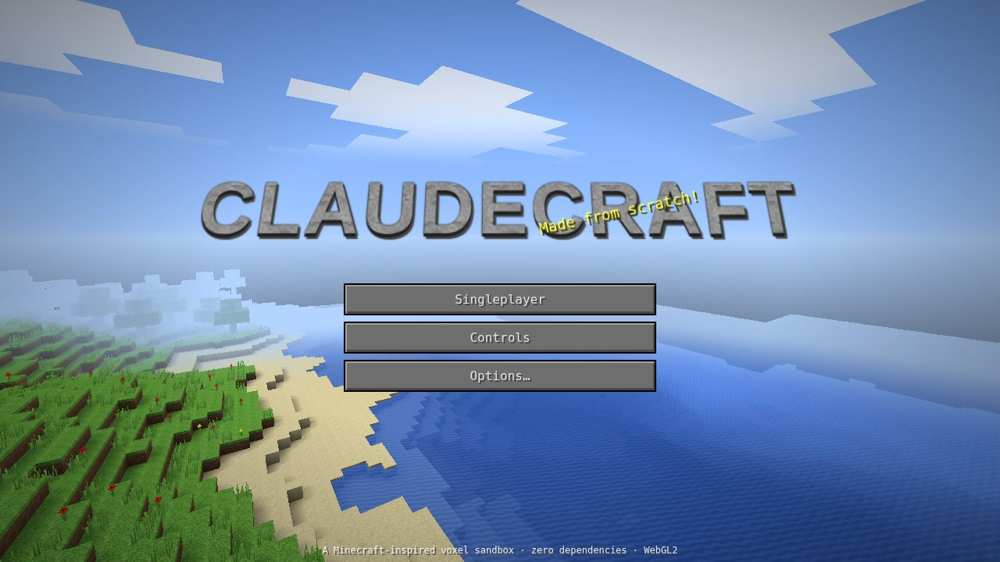

## ⬇️ Download & play

| Platform | Download | How to run |
|---|---|---|
| **Windows** | [**ClaudeCraft.exe**](https://github.com/Jeep200092919/Minecraft-Claude-Version/raw/HEAD/downloads/ClaudeCraft.exe) (6.8 MB) | Double-click it. The game opens in its own window, and friends on your network can join you (**Open to LAN**). |
| **Any OS** | [**ClaudeCraft.zip**](https://github.com/Jeep200092919/Minecraft-Claude-Version/raw/HEAD/downloads/ClaudeCraft.zip) (3.0 MB) | Unzip it, then run `ClaudeCraft.exe` (Windows) or open `ClaudeCraft.html` in your browser. |
| **Single file** | [**ClaudeCraft.html**](https://github.com/Jeep200092919/Minecraft-Claude-Version/raw/HEAD/downloads/ClaudeCraft.html) (0.7 MB) | Open it in Chrome, Edge or Firefox. The whole game is this one file. |

- **About the .exe:** it is a small launcher with the complete game embedded inside. It unpacks the game to `%LOCALAPPDATA%\ClaudeCraft` and opens it in a chromeless Microsoft Edge (or Chrome) app window, so it looks like a normal desktop program. Edge ships with Windows 10 and 11. While the game is open it also runs the LAN multiplayer server on port 25565, so Windows may ask whether to allow it through the firewall (allow it to play with friends). The launcher isn't code-signed, so Windows SmartScreen may show *"Windows protected your PC"*. Click **More info → Run anyway**. If you'd rather not run an .exe, the `.html` file is the same game.
- **Requirements:** a browser with WebGL2 (any recent Chrome, Edge, Firefox or Safari), plus a keyboard and mouse. Shaders are on by default. On a slow or integrated GPU, turn off **Options → Shaders** (or just **Shadows**) for the classic look and a higher frame rate.
- Worlds are **saved automatically** in the browser (every 30 s, on pause, and on quit).

## Screenshots

| | |
|---|---|
| 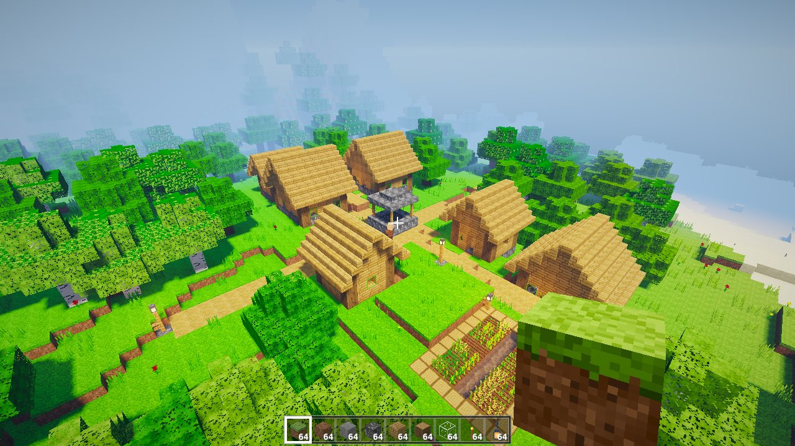 | 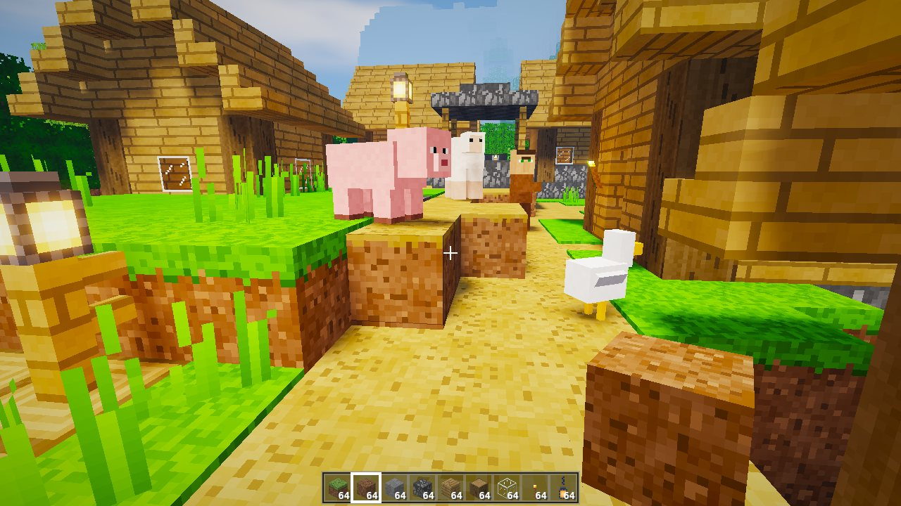 |
| 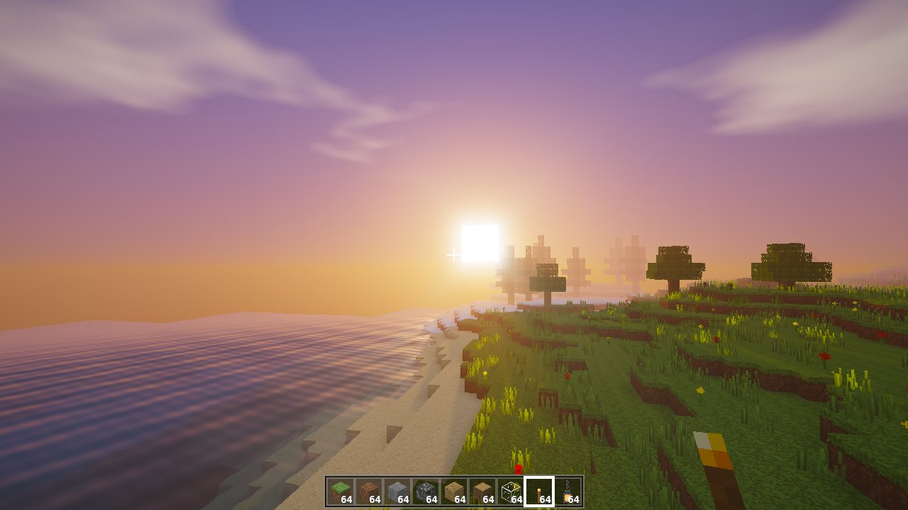 | 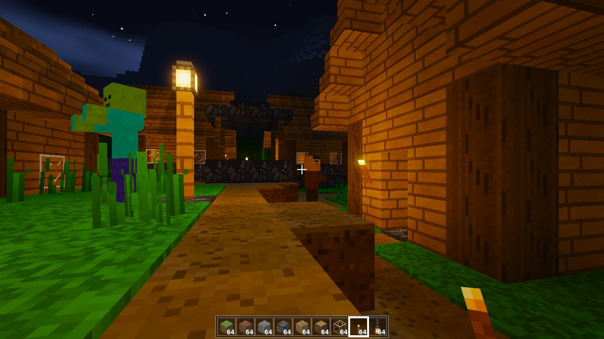 |
| 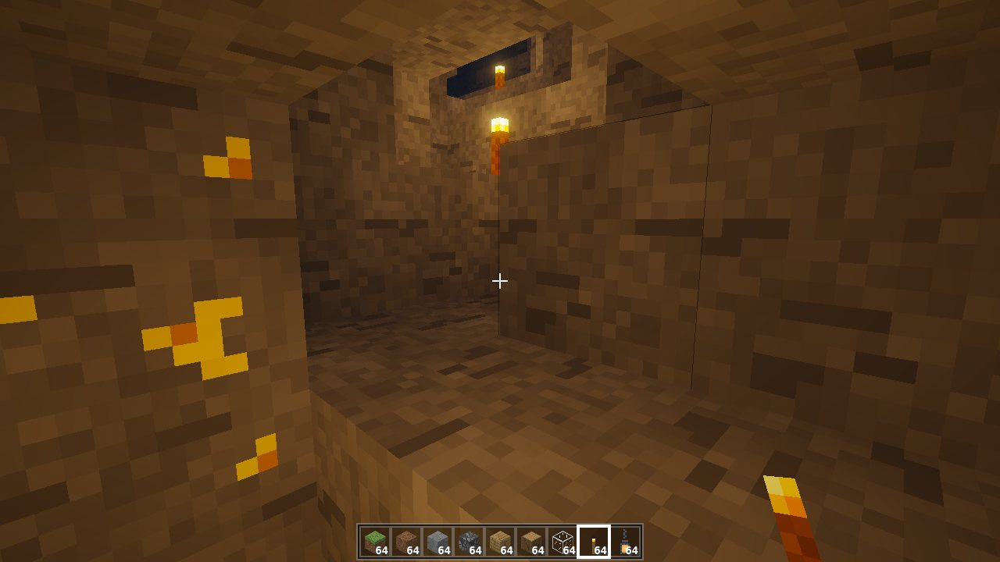 | 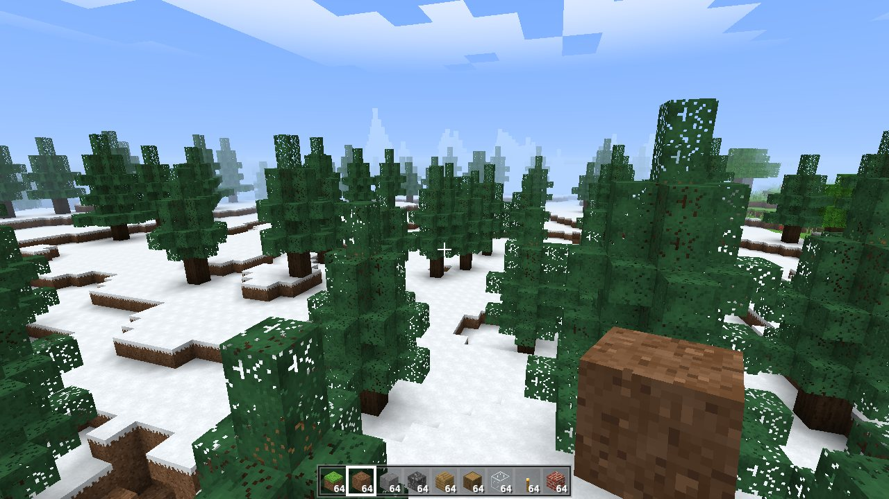 |
| 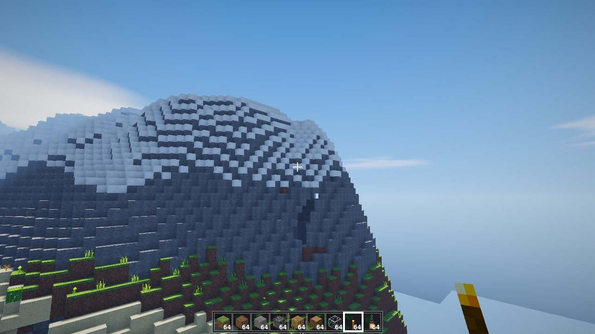 | 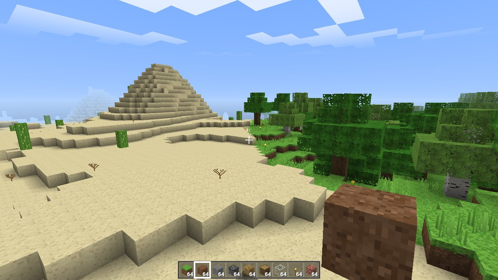 |

| 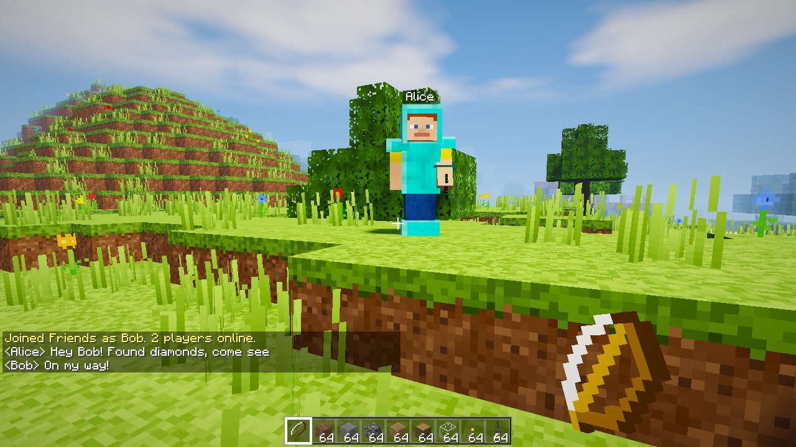 | 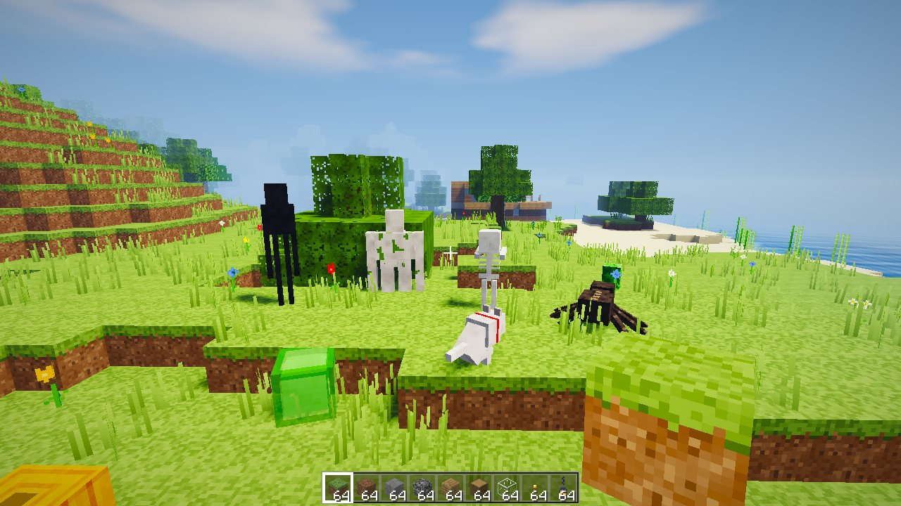 |
| 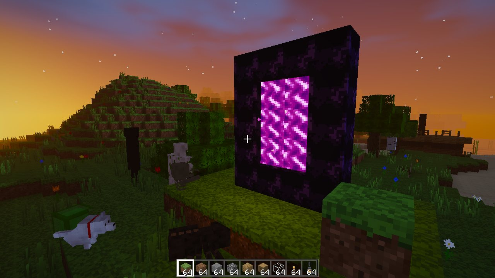 | 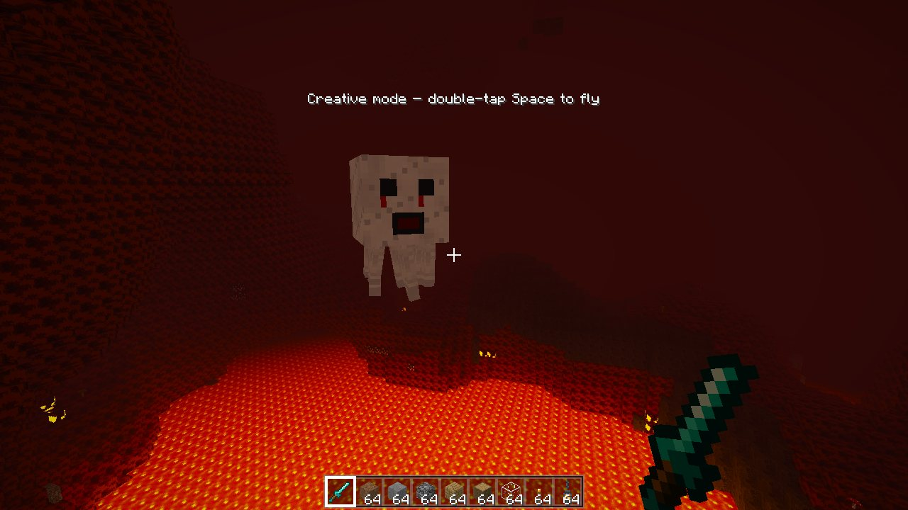 |
| 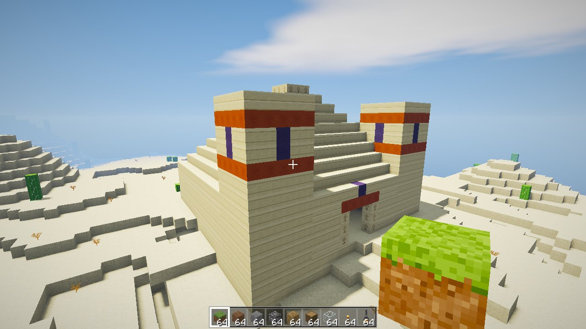 | 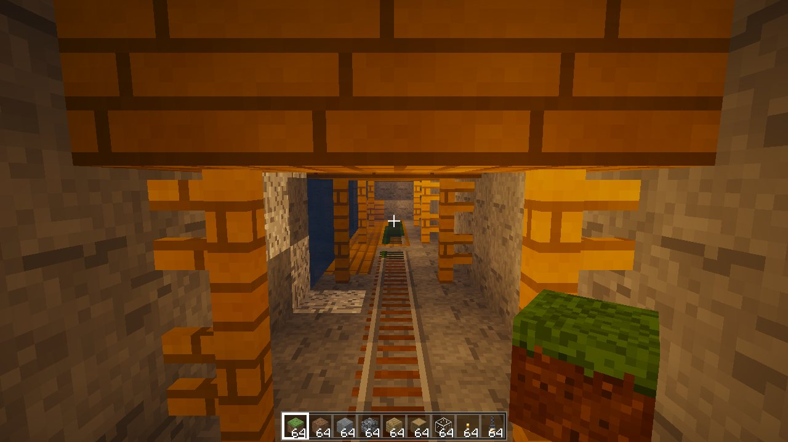 |
| 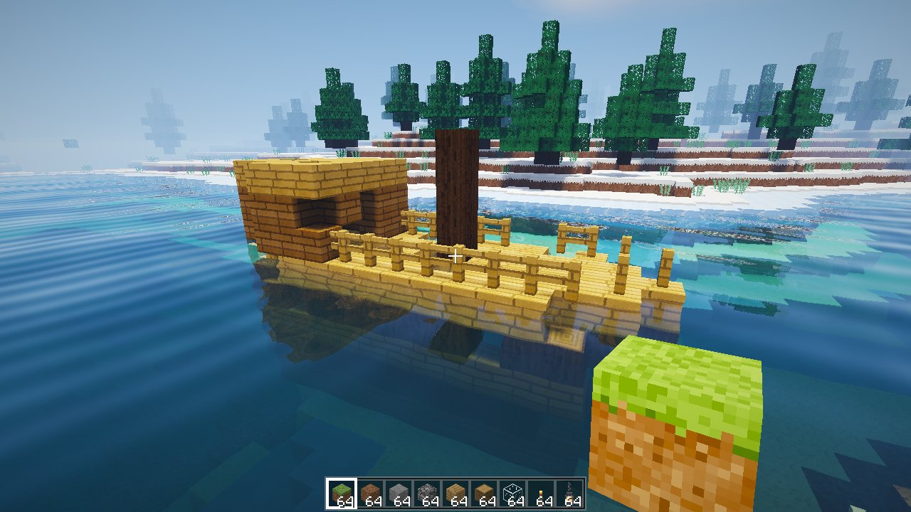 | 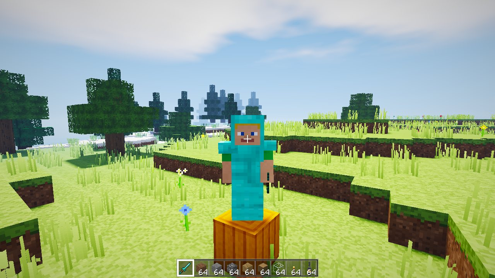 |

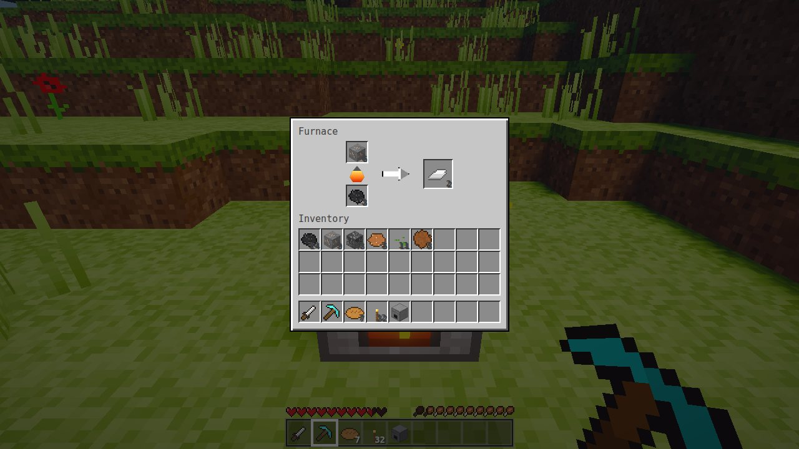

## The prompt, recreated

The original request was *"create a Minecraft from scratch"*. Before writing any code, I expanded it into this full specification and then built it:

> Build a playable, Minecraft-style voxel sandbox **from scratch**: vanilla JavaScript and raw WebGL2, zero dependencies, no copied or downloaded assets.
>
> 1. **Infinite procedural world.** Seeded and deterministic, streamed in 16×128×16 chunks around the player. Continents and oceans, beaches, plains, forests, deserts, snowy tundra and mountains with snow caps. Winding "spaghetti" caves and big caverns, lava lakes deep underground, ore veins (coal, iron, gold, diamond) at realistic depths, trees that cross chunk borders (oak, birch, spruce), cacti, flowers and tall grass.
> 2. **Proper rendering.** Hidden-face culling, per-vertex ambient occlusion, smooth lighting, sunlight *and* torch light spread by flood fill and updated live when you edit the world. Pixel-art texture array, transparent water, cut-out leaves and glass, swaying plants, animated water, a day/night cycle with sun, moon, stars and sunsets, drifting clouds, distance fog, and underwater/lava effects.
> 3. **Player.** First-person with mouse look, walking, sprinting, sneaking (you can't fall off edges), jumping, swimming, and flying in Creative. Real AABB collision, gravity, fall damage, drowning, lava and cactus damage, health regeneration, death and respawn.
> 4. **Interaction.** Precise block targeting with an outline. Hold-to-mine with crack animation and particles; mining speed and drops depend on the tool (wood, stone, iron and diamond pickaxes, axes and shovels). Block placing, torches on floors and walls, falling sand and gravel, plants and torches that pop off when their support breaks, simple water flow.
> 5. **Survival & Creative modes.** 36-slot inventory with a hotbar, Minecraft-style stack handling (split, merge, shift-click). 2×2 crafting in the inventory and 3×3 at a crafting table, with real recipes. Creative gets a block palette and instant breaking.
> 6. **A real game shell.** Title screen with a live world panorama, a world list (create, select, delete, custom seeds), a pause menu, options (render distance, FOV, sensitivity, volume, view bobbing, invert mouse), a controls screen, a debug overlay (F3), autosave, and procedurally synthesized sound effects.
> 7. **Engineering.** Clear modules, unit tests for the engine logic, an end-to-end browser smoke test, a single-file build, and downloadable Windows .exe and .zip releases.

Everything in that list is implemented. See [Known limitations](#known-limitations) for what's deliberately out of scope.

### Update: "make it look like I'm playing the real Minecraft, with shaders"

The second request asked for more content and a look similar to a Minecraft shader pack (the reference was *Sildur's Enhanced Default*). It added:

> 8. **Shaders** (toggle in Options). HDR rendering with a sun/moon shadow map and soft filtered shadows. Sky colours that follow the time of day, with a glowing sun, warm sunsets and a moonlit night. Water with screen-space reflections, refraction, depth tint, fresnel and sun glints. Bloom, god rays, automatic exposure, ACES tone mapping and colour grading. Leaves and grass sway in the wind, grass and leaves get Minecraft-style biome tints, and torches, lanterns and lava glow.
> 9. **Mobs.** Pigs, cows, sheep and chickens that wander, graze and flee when hit. Zombies that chase you at night and burn in daylight. Creepers that hiss and explode. Villagers that live in villages. Melee combat with swords, knockback, critical hits and drops. Spawn eggs in Creative.
> 10. **Survival depth.** A hunger bar with saturation and exhaustion (sprinting, jumping, mining and fighting make you hungry), eating by holding right click, regeneration when well fed and starvation damage. Furnaces with fuel and smelting (ores, sand, food), and 27-slot chests.
> 11. **Farming and new blocks.** Hoes till grass into farmland; wheat grows in four stages and can be baked into bread. Plus lanterns, fences, stairs, slabs, dirt paths, mossy cobblestone, cornflowers, oxeye daisies and TNT, lit with flint and steel.
> 12. **Villages** with houses, a well, farms, lamp posts and chests holding loot. Stair-roofed houses have furnished interiors.
> 13. **Atmosphere.** Calm generative piano music, mob sounds, and smoke, explosion and critical-hit particles.

### Update: "add everything that the real Minecraft has, and multiplayer"

The third request asked for better animals and items, more items and structures ("monuments"), multiplayer where everyone spawns at the same place, and for the game to feel much more like the real thing. It added:

> 14. **Look and feel.** A pixel font for all text, Minecraft-style stone buttons and a stone logo, hand-drawn item sprites (tools on a 45° grid, armour, food, ingots, gems…) that are extruded into 3D when held or dropped, re-painted mob skins with shading, a third-person camera (F5) that shows your character, armour and held item, and more neutral daylight shading.
> 15. **Items and blocks.** 200+ blocks and 140+ items: granite, diorite and andesite, deepslate ores, copper, lapis, redstone and emerald ores, clay, ice, terracotta, sandstone variants, prismarine, 16 wool colours, glass panes, iron bars, ladders, rails, doors, beds, pumpkins, melons, carrots, potatoes, sugar cane, saplings that grow into trees, mushrooms and flowers; armour in leather, iron, gold and diamond, bows and arrows, buckets of water, lava and milk, shears, compasses, clocks, spawn eggs and more. Items drop on the ground and are picked up, tools wear out, and killing mobs or mining ores gives experience.
> 16. **Mobs (21).** Skeletons that strafe and shoot aimed arrows; spiders that climb walls and pounce; endermen that get angry when you look at them, teleport and carry blocks; slimes that split; wolves in packs that you can tame with bones (they sit, follow and fight for you); iron golems guarding villages; squid, cod and bats; rabbits; guardians with charging lasers in ocean monuments; plus zombified piglins, ghasts and magma cubes in the Nether.
> 17. **Structures.** Desert pyramids with the hidden treasure room and its TNT trap, desert wells, igloos (some with a secret basement), ruined portals, shipwrecks, ocean monuments guarded by guardians, mineshaft networks and dungeons with working monster spawners, each with its own loot. Find them with `/locate`.
> 18. **The Nether.** Light an obsidian frame with flint and steel to open a portal. The Nether is a cavern dimension over a lava sea, with glowstone, quartz, soul sand and its own mobs; distances there are 1/8 of the Overworld's.
> 19. **Multiplayer.** A zero-dependency server (Node.js, or built into the Windows launcher for LAN games). Everyone spawns at the same world spawn, sees the others with name tags, chats, trades hits, and shares one world: blocks, chests and furnaces, mobs, time and weather.
> 20. **More of the game.** Weather (rain, snow, thunderstorms with lightning), beds that skip the night, doors, chat with commands, a player list (Tab), creative inventory tabs with search, and an armour/XP HUD.

### Update: "insert my own shaders, don't close on Ctrl+W, and easy servers"

The fourth request asked for custom shaders, protection against closing the game with Ctrl+W, and a multiplayer menu where anyone can join a server and creating one only takes a name. It added:

> 21. **Custom shader packs** (**Options → Shader Packs…**). Write a GLSL fragment shader in the built-in editor, paste one (Shadertoy-style `mainImage` code works too) or import a `.glsl` file. It runs over every frame, on top of the classic look or the built-in shaders. Six example packs are included to start from.
> 22. **Ctrl+W doesn't close the game.** The game plays in fullscreen with the keyboard locked, so browser shortcuts like Ctrl+W go to the game. Where the browser doesn't allow that, closing the tab mid-game asks for confirmation first.
> 23. **Server list.** **Multiplayer** lists the servers on your network, and joining one is a single click. To host, type a server name and click **Create Server**.

## Controls

| Key | Action |
|---|---|
| **W A S D** | Move |
| **Mouse** | Look around |
| **Space** | Jump / swim up / fly up |
| **Shift** | Sneak (won't fall off edges) / fly down |
| **Ctrl** or double-tap **W** | Sprint |
| Double-tap **Space** | Toggle flying (Creative) |
| **Left click** | Break block (hold to mine in Survival) / attack a mob |
| **Right click** | Place block / open a chest, furnace or crafting table / use a hoe, seeds, spawn egg or flint and steel |
| Hold **right click** | Eat the food in your hand |
| **Middle click** | Pick block |
| **1–9** / mouse wheel | Select hotbar slot |
| **E** | Inventory & crafting |
| **Q** / **Ctrl+Q** | Drop the held item / the whole stack |
| **T** or **Enter** | Chat (**/** starts a command, try `/help`) |
| **Tab** | Players online (multiplayer) |
| **F5** | Third-person camera (behind / in front) |
| **F3** | Debug info (FPS, position, biome, light…) |
| **F1** | Hide HUD |
| **Esc** | Pause menu |

In the inventory: **left click** picks up or places a stack, **right click** splits a stack or places one item, **shift-click** moves items quickly (straight into a furnace's input or fuel slot when one is open).

While you play, the game is fullscreen and keeps the keyboard, so **Ctrl+W**, **Ctrl+Q**, **Ctrl+S** and similar shortcuts don't close or leave the page (turn this off with **Options → Fullscreen**). **Esc** pauses and leaves fullscreen, and going back to the game re-enters it. In the menus, or in browsers without keyboard lock (it works in Chrome and Edge), closing the tab mid-game asks for confirmation instead.

## Multiplayer

Everyone plays in the same world and spawns at the same place. Click **Multiplayer** on the title screen:

- **Join:** servers on your network appear in the list with their player count and mode. Click **Join**. To reach a server that isn't listed (for example over the internet), type its address (like `192.168.1.20:25565`) and click **Join**.
- **Create a server:** type a name, choose Survival or Creative, and click **Create Server**. A new world starts and is opened to your network straight away, and it shows up in everyone else's list. When you quit, the server closes for everyone.

Hosting needs the part of the game that runs the server: `ClaudeCraft.exe` has it built in (Windows may ask to allow it through the firewall: allow it). With the `.html` file, run `node tools/server.mjs --lan` from the source code first. You can also open any single-player world to your network with **Esc → Open to LAN**.

- **Always-on server:** with [Node.js](https://nodejs.org) 22+, run `npm run server` (or `node tools/server.mjs --port 25565 --seed mySeed --mode survival --name "My Server"`) from the source code. The world is saved to `worlds/server.json`, and players join from the list or at `http://<server address>:25565/`.

Servers announce themselves on the local network (UDP broadcast on port 25566), so the list only shows servers on the same network. Friends elsewhere need the host's public address and a forwarded port 25565.

The first player in a world runs the mobs, items, TNT, crops and furnaces for everybody; when they leave, the next player takes over. The server keeps the block changes, chest and furnace contents, time, weather and each player's inventory (by name). The Nether isn't available in multiplayer yet.

## Commands

Press **T** and type a command: `/help`, `/time set day|noon|night|midnight|<ticks>`, `/time add <ticks>`, `/weather clear|rain|thunder`, `/gamemode survival|creative`, `/tp <x> <y> <z>` (`~` for relative), `/give <item> [count]`, `/summon <mob> [slime size]`, `/kill`, `/spawnpoint`, `/xp <amount>`, `/clear`, `/locate <structure>` and `/seed`.

## Getting started in Survival

1. Punch a tree (hold left click) to collect logs.
2. Press **E**, put a log in the crafting grid, and take **4 planks**.
3. Make **sticks** (2 planks stacked vertically) and a **crafting table** (2×2 planks).
4. Place the table, right-click it, and craft a **wooden pickaxe** and a **wooden sword**.
5. Mine stone for cobblestone, then upgrade to **stone tools** and build a **furnace** (8 cobblestone in a ring).
6. Smelt iron ore into ingots with coal as fuel, and cook meat from animals: cooked food fills far more hunger than raw.
7. Craft **torches** (coal above a stick) and light up your base: zombies and creepers spawn in the dark.
8. Look for a **village**: the houses have crafting tables and furnaces, and some have chests with food, iron and sometimes a diamond. An iron golem guards it.
9. Craft **armour** from leather, iron, gold or diamonds (right-click with a piece to put it on), a **bow** and arrows, and a **bed** (3 wool on 3 planks) to skip the night and set your respawn point.
10. Explore: desert pyramids, mineshafts, dungeons, shipwrecks and igloos hide chests. Build a 4×5 frame of **obsidian** (pour water on lava to make it, or find a ruined portal) and light it with **flint and steel** to reach the Nether.

### Recipes

| Result | Recipe |
|---|---|
| 4 Planks | 1 log (oak, birch or spruce) |
| 4 Sticks | 2 planks, vertical |
| Crafting Table | 2×2 planks |
| 4 Torches | coal above a stick |
| Furnace | 8 cobblestone in a ring |
| Chest | 8 planks in a ring |
| Pickaxe / Axe / Shovel / Sword / Hoe | the usual Minecraft shapes, with planks, cobblestone, iron ingots or diamonds and sticks |
| 3 Oak Fences | plank, stick, plank on two rows |
| 4 Stairs | 6 planks or cobblestone in a staircase |
| 6 Slabs | a row of 3 planks, cobblestone or stone |
| Lantern | iron ingot above a torch |
| Bread | a row of 3 wheat |
| TNT | gunpowder and sand in a checkerboard |
| Flint and Steel | iron ingot + flint |
| Mossy Cobblestone | cobblestone + tall grass |
| Sandstone | 2×2 sand |
| 4 Stone Bricks | 2×2 stone |
| Block of coal / iron / gold / diamond / emerald / lapis / redstone | 9 of the item (and back again) |
| Helmet / Chestplate / Leggings / Boots | the usual armour shapes, in leather, iron ingots, gold ingots or diamonds |
| Bow | 3 sticks and 3 string |
| 4 Arrows | flint, stick and feather, stacked |
| Bed | 3 wool above 3 planks |
| 3 Oak Doors | 2×3 planks |
| 3 Ladders | 7 sticks in an H |
| 16 Rails | 6 iron ingots and a stick |
| Bucket / Shears | 3 / 2 iron ingots |
| Golden Apple | an apple surrounded by 8 gold ingots |
| Compass / Clock | 4 iron / gold ingots around redstone |
| Bookshelf | 6 planks and 3 books |
| Stone Pressure Plate | 2 stone side by side |
| Prismarine / Prismarine Bricks / Sea Lantern | prismarine shards (and crystals) |
| White Wool | 2×2 string |

**Furnace:** put something to smelt on top and fuel below. One item takes 10 seconds. Coal burns for 80 s (8 items), planks and logs for 15 s, and a block of coal for 800 s.

| Smelt | Into |
|---|---|
| Iron ore / gold ore | Iron / gold ingot |
| Sand | Glass |
| Cobblestone | Stone |
| Any log | Coal (charcoal) |
| Cactus | Green wool (dye) |
| Raw porkchop, beef, chicken, mutton, rabbit, cod | Cooked versions |
| Potato | Baked potato |

Better tools mine faster, and some blocks need them: stone and coal need a pickaxe, iron ore a stone pickaxe, and gold/diamond an iron pickaxe. Swords deal 5 (wood) to 8 (diamond) damage. Hitting a mob while falling is a critical hit (×1.5). Gravel sometimes drops flint, tall grass drops wheat seeds and oak leaves sometimes drop apples.

### Mobs

| Mob | Health | Behaviour | Drops |
|---|---|---|---|
| Pig | 10 | wanders, flees when hurt | raw porkchop |
| Cow | 10 | wanders, flees when hurt, can be milked | raw beef, leather |
| Sheep | 8 | wanders, can be sheared, regrows wool by eating grass | wool, raw mutton |
| Chicken | 4 | wanders, flutters down slowly, eggs can hatch chicks | raw chicken, feathers |
| Rabbit | 3 | hops away from you | raw rabbit |
| Wolf | 8 (20 tamed) | packs in forests and snow; tame with bones, then it sits (right click), follows and fights for you | — |
| Villager | 20 | lives in a village, runs from zombies | — |
| Iron Golem | 100 | guards villages, flings monsters into the air | iron ingots, poppies |
| Squid | 10 | swims, squirts ink | ink sacs |
| Cod | 3 | swims in schools | raw cod |
| Bat | 6 | flutters around caves, hangs from ceilings | — |
| Zombie | 20 | chases you (and villagers), burns in sunlight | rotten flesh |
| Skeleton | 20 | keeps its distance, strafes and shoots arrows, burns in sunlight | bones, arrows |
| Creeper | 20 | sneaks up, hisses and explodes | gunpowder |
| Spider | 16 | climbs walls and pounces; neutral in daylight | string, spider eyes |
| Enderman | 40 | gets angry if you look at it, teleports, carries blocks, hates water | ender pearls |
| Slime | 1 / 4 / 16 | hops, splits into smaller slimes; spawns deep underground in slime chunks | slimeballs |
| Guardian | 30 | swims around ocean monuments and charges a laser | prismarine shards and crystals, raw cod |
| Zombified Piglin | 20 | Nether; neutral, but the whole group attacks if you hit one | rotten flesh, gold nuggets |
| Ghast | 10 | Nether; flies and shoots exploding fireballs (punch them back!) | ghast tears, gunpowder |
| Magma Cube | 1 / 4 / 16 | Nether; hops and splits, immune to lava | magma cream |

Animals spawn on grass under the open sky (rabbits also on sand and snow). Monsters spawn in dark places (outside at night, or in caves) and despawn when you walk far away. Dungeons and mineshafts have monster spawners with a tiny spinning mob inside.

## Run from source

No install step is needed. [Node.js](https://nodejs.org) 22+ is only used for the dev server, tests and builds.

```bash
npm start            # dev server at http://localhost:8080 (ES modules, no bundling)
npm run server       # multiplayer server at http://localhost:25565 (serves the game too)
npm test             # unit tests (node:test)
npm run build        # dist/claudecraft.html, a single self-contained file
npm run package      # downloads/ClaudeCraft.{html,zip,exe} (the .exe needs Go 1.21+)
npm run smoke        # end-to-end test in headless Chromium (needs Playwright)
```

You can also play straight from GitHub Pages: in the repo settings, enable **Pages → Deploy from a branch** with the root folder. `index.html` runs the modules directly.

### Making a GitHub Release

`.github/workflows/release.yml` builds the zip and exe on GitHub's servers and attaches them to a Release. You can trigger it by pushing a tag like `v1.0.0`, or by running it from the **Actions** tab (*Release → Run workflow*).

## How it works

```
src/
  main.js        entry point
  game.js        game states, main loop, gameplay rules (breaking, placing, combat, eating, saving)
  world.js       chunk storage, streaming pipeline (generate → light → mesh), light flood-fill, block entities
  worldgen.js    terrain, biomes, caves, ores, trees, plants (seeded simplex noise)
  nether.js      the Nether: caverns over a lava sea, glowstone, quartz, soul sand
  villages.js    village layout and placement (well, roads, houses, farms, lamps)
  structures.js  pyramids, wells, igloos, ruined portals, shipwrecks, monuments, mineshafts, dungeons, loot tables
  net.js         multiplayer client: world sync, entity snapshots, remote players, name tags
  chunk.js       16×128×16 chunk data (blocks + packed sky/block light + heightmap + climate)
  mesher.js      face culling, ambient occlusion, smooth lighting, 16-byte packed vertices, shaped blocks
  renderer.js    WebGL2: classic and shader pipelines, shadows, water, sky, clouds, post-processing, entities
  shaders.js     all GLSL: terrain, shadow, water (SSR), sky, clouds, bloom, god rays, composite
  shaderpacks.js custom shader packs: the wrapper that turns a pack into a shader, and the example packs
  sky.js         sun/moon position, sky and light colours for any time of day
  entities.js    mob AI, spawning, combat, items, XP, arrows, TNT, multiplayer snapshots, render data
  mobs.js        mob definitions, box-UV models and procedural 64×64 skins
  playermodel.js player model with armour and held item (third person and other players)
  interact.js    right-click rules: placing, doors, beds, buckets, farming, spawn eggs, armour
  weather.js     rain, snow and lightning
  chat.js        chat box and commands
  font.js        the pixel font, built as a TrueType font at startup
  itemart.js     hand-drawn item sprites (tools, armour, food…)
  physics.js     shared AABB-vs-voxel collision with step-up (player and mobs)
  gameplay.js    furnaces, crop growth, explosions
  player.js      movement, swimming, flying, damage, hunger
  raycast.js     voxel DDA ray traversal with per-shape hit boxes
  blocks.js      block/item registry, tool rules, food, crafting and smelting recipes
  inventory.js   inventory model, Minecraft-style slot clicks, recipe matching
  textures.js    procedural 16×16 pixel-art textures (blocks, items, cracks)
  icons.js       isometric inventory icons, hearts, hunger and air bubbles
  particles.js   block debris, smoke and explosions
  audio.js       WebAudio-synthesized sound effects, mob sounds and generative music
  input.js       keyboard, mouse, pointer lock
  ui.js          menus, HUD, inventory, crafting, chest and furnace screens
  storage.js     localStorage saves (seed + player edits + container contents)
  noise.js       seeded PRNG + 2D/3D simplex noise
launcher/        Go launcher that turns the game into ClaudeCraft.exe, with the LAN server built in
tools/           dev server, multiplayer server, zero-dependency bundler, packager, browser smoke test
test/            unit tests
```

Some of the techniques used:

- **Deterministic chunk generation.** A chunk's contents depend only on the seed and its coordinates, so chunks can be generated in any order. Trees are decided per chunk from column data alone, so a tree that crosses a chunk border is identical on both sides. Cave noise is sampled on a coarse 4-block lattice and interpolated.
- **Staged streaming.** A chunk is *generated*, then *lit* once its 8 neighbours exist, then *meshed* once its neighbours are lit. The work is time-boxed per frame, nearest chunks first.
- **Lighting.** Minecraft-style 0–15 sky and block light, stored as nibbles. It uses breadth-first flood fill with incremental add/remove passes on every block change, and sunlight travels straight down without dimming.
- **Meshing.** Only faces touching non-opaque blocks are emitted. Each vertex carries ambient occlusion and averaged (smooth) light, and quads are flipped along the brighter diagonal to avoid AO artifacts. Vertices are packed into 16 bytes, and one shared index buffer serves every chunk.
- **Rendering.** A texture array with mipmaps prevents atlas bleeding. Geometry is rendered camera-relative so precision holds far from the origin. Chunks are frustum-culled, and water is drawn back-to-front in a separate blended pass.
- **Shaders.** With shaders on, the scene is rendered in linear HDR to a floating-point framebuffer. A sun (or moon) shadow map snapped to texels is sampled with a Poisson-disc PCF. Water is drawn after the opaque scene is copied, so it can ray-march that copy for screen-space reflections and refract what's below. A bright pass feeds a 3-level bloom, a radial blur of the sky mask makes god rays, and the result is exposure-adapted, ACES tone-mapped and colour-graded. Grass and leaves are stored as grayscale and tinted per vertex from the biome's temperature and humidity, like Minecraft's colour maps.
- **Custom shader packs** are a last full-screen pass. The finished frame is copied to a texture (`uScene`), and the pack's code is wrapped with the uniforms and, for Shadertoy code, a `main()` that calls `mainImage`. Compile errors are reported with line numbers that match the editor.
- **Mobs** are built from boxes with Minecraft-style box UV mapping onto procedurally painted 64×64 skins. All skins live in one texture array. Walking animates legs and arms, and heads turn to look at you.
- **Villages** are planned per 224×224-block region from the seed and column heights only, so, like trees, each chunk can draw its part of a village without its neighbours.
- **Structures** (pyramids, mineshafts, monuments…) are planned the same way, per region from the seed and column data, so every chunk draws its own slice. Mineshafts grow as a network of corridors, crossings and stairs that never overlap.
- **Saves** store only the seed, the blocks the player changed (as base64-packed `(index, id)` triplets per chunk, per dimension) and the contents of chests and furnaces. The rest is regenerated.
- **Multiplayer** uses a small WebSocket protocol (the WebSocket framing is hand-written in both the Node and Go servers). Block changes, chests and time go through the server, which stores them; one player's game simulates entities and streams compact snapshots ten times a second that the others interpolate, and it sends its hits, drops, arrows and interactions to that player. Servers announce their name, port, mode and player count by UDP broadcast every 2 seconds; the local server collects what it hears and gives the list to the game at `/api/servers`.

## Known limitations

- No redstone circuits, enchanting, potions, minecarts, boats or End. Nether fortresses and bastions aren't generated.
- The Nether can't be visited in multiplayer yet, and multiplayer has no accounts or protection: anyone who can reach the server can join with any name.
- Mob AI is simple: mobs walk straight towards or away from you and jump up single blocks, with no real pathfinding.
- Water flows a few blocks from where you open it up, but it's not Minecraft's full fluid simulation. Lava is static.
- Shaders need a reasonably modern GPU. Integrated graphics may need **Shadows** or **Shaders** turned off.
- Needs a keyboard and mouse. Touch devices aren't supported.
- Saves live in the browser's local storage, so clearing site data deletes them.

## Credits

ClaudeCraft is a fan project inspired by *Minecraft* by Mojang Studios. It is not affiliated with or endorsed by Mojang or Microsoft. It contains no Mojang code or assets: every texture, mob skin, icon, sound and note of music is generated procedurally by this project's own code.
